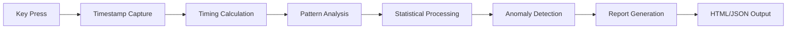

# 🔐 Advanced Keystroke Dynamics Analysis Tool

<div align="center">


**A professional-grade behavioral biometrics monitoring system for keystroke pattern analysis**

[Features](#-features) • [Installation](#-installation) • [Usage](#-usage) • [Documentation](#-documentation) • [Examples](#-examples) • [Contributing](#-contributing)


</div>

---

## 📋 Table of Contents

- [Overview](#-overview)
- [Key Features](#-features)
- [How It Works](#-how-it-works)
- [Installation](#-installation)
- [Quick Start](#-quick-start)
- [Usage Guide](#-usage-guide)
- [Configuration](#-configuration)
- [Report Analysis](#-report-analysis)
- [Privacy & Security](#-privacy--security)
- [Use Cases](#-use-cases)
- [Technical Details](#-technical-details)
- [FAQ](#-faq)
- [Contributing](#-contributing)
- [License](#-license)
- [Disclaimer](#-disclaimer)

---

## 🎯 Overview

The **Advanced Keystroke Dynamics Analysis Tool** is a sophisticated Python-based behavioral biometrics system that captures, analyzes, and visualizes typing patterns with millisecond precision. Originally developed for security research and behavioral authentication studies, this tool provides comprehensive insights into typing behavior through advanced statistical analysis and beautiful visual reports.

### What Makes This Tool Special?

- 🎨 **Stunning Visual Reports** - Generate beautiful, interactive HTML reports with modern design
- ⚡ **Real-Time Analysis** - Capture keystroke dynamics with microsecond precision
- 📝 **Complete Word Tracking** - See exactly what was typed, not just statistics
- 🔬 **Scientific Analysis** - Statistical metrics including Z-score anomaly detection
- 🛡️ **Privacy-First** - Configurable anonymization and data hashing options
- 🌍 **Cross-Platform** - Works seamlessly on Windows, macOS, and Linux

---

## ✨ Features

### Core Capabilities

| Feature | Description |
|---------|-------------|
| **⌨️ Keystroke Monitoring** | Captures every keypress with precise timing data |
| **📝 Word Tracking** | Records complete words and phrases in real-time |
| **📊 Statistical Analysis** | Calculates dwell time, flight time, digraphs, and trigraphs |
| **🎯 Anomaly Detection** | Identifies unusual typing patterns using Z-score analysis |
| **📈 Typing Metrics** | Measures KPM (Keys Per Minute) and WPM (Words Per Minute) |
| **🎨 HTML Reports** | Beautiful, interactive reports with charts and visualizations |
| **📄 JSON Export** | Machine-readable data export for further analysis |
| **🔔 Notifications** | Optional Telegram and Discord integration |
| **🔒 Privacy Controls** | Anonymization, hashing, and data protection options |

### Analysis Metrics

- **Dwell Time**: Duration each key is held down
- **Flight Time**: Time between consecutive key releases
- **Digraphs**: Two-key combination patterns (e.g., "th", "he")
- **Trigraphs**: Three-key combination patterns (e.g., "the", "ing")
- **Word Statistics**: Length, speed, and timing of complete words
- **Anomaly Detection**: Statistical outliers in typing behavior
- **Pattern Recognition**: Most frequent key combinations

---

## 🔬 How It Works



### The Analysis Pipeline

1. **Capture Phase**: Records every keystroke with precise timestamps
2. **Processing Phase**: Calculates timing metrics (dwell, flight times)
3. **Pattern Phase**: Identifies digraphs, trigraphs, and word sequences
4. **Analysis Phase**: Performs statistical analysis and baseline comparison
5. **Detection Phase**: Identifies anomalies using Z-score methodology
6. **Reporting Phase**: Generates beautiful visual reports

---

## 🚀 Installation

### Prerequisites

- Python 3.7 or higher
- pip package manager

### Step 1: Clone the Repository

```bash
git clone https://github.com/notfawadmir/Keylogger.git
cd Keylogger
```

### Step 2: Install Dependencies

```bash
pip install pynput requests
```

**Required Packages:**
- `pynput` - Keyboard monitoring and event handling
- `requests` - Optional, for remote notifications

### Step 3: Verify Installation

```bash
python keylogger.py
```

You should see the welcome banner and menu!

---

## 🎮 Quick Start

### Basic Usage

1. **Launch the tool**
```bash
python keylogger.py
```

2. **Confirm authorization** (required for legal compliance)
```
Do you have authorization to use this tool? (yes/no): yes
```

3. **Select option 1** - Start Monitoring Session

4. **Start typing!** Type some words and sentences

5. **Press ESC** to stop monitoring

6. **View your report** - Opens automatically in your browser

### Your First Analysis

Try this simple test:
```
1. Start the tool
2. Type: "The quick brown fox jumps over the lazy dog"
3. Press ESC
4. Check the generated HTML report in ./keystroke_reports/
```

---

## 📖 Usage Guide

### Main Menu Options

```
MAIN MENU
======================================================================
1. Start Monitoring Session (Default: 1 hour)
2. Start Custom Duration Session
3. Configure Settings
4. View Current Configuration
5. Test Remote Notifications
6. Exit
======================================================================
```

### Option 1: Default Session

Starts a 1-hour monitoring session. Perfect for:
- General typing analysis
- Long-term pattern observation
- Behavioral baseline establishment

### Option 2: Custom Duration

Set your own monitoring time:
```bash
Enter duration in seconds: 60  # 1 minute session
```

Ideal for:
- Quick tests (30-60 seconds)
- Specific task monitoring (5-10 minutes)
- Extended research (multiple hours)

### Option 3: Configuration

Customize every aspect of the tool:

**Privacy Settings:**
- Capture actual key content or anonymize
- Enable/disable key hashing
- Control data visibility

**Output Settings:**
- Toggle JSON reports
- Toggle HTML reports
- Configure output directory

**Analysis Settings:**
- Adjust anomaly detection threshold
- Set minimum sample requirements
- Configure statistical parameters

**Notification Settings:**
- Enable Telegram notifications
- Enable Discord webhooks
- Configure remote alerts

### Option 4: View Configuration

Display current settings without making changes.

### Option 5: Test Notifications

Verify Telegram/Discord integration is working properly.

---

## ⚙️ Configuration

### Privacy Configuration

```python
# In keylogger.py - Config class

# Capture actual keys (required for word tracking)
CAPTURE_CONTENT = True

# Anonymize personal data
ANONYMIZE_DATA = False

# Hash key identifiers for privacy
HASH_KEYS = False

# Enable word tracking
TRACK_WORDS = True
```

### Analysis Configuration

```python
# Session settings
SESSION_DURATION = 3600  # 1 hour default

# Anomaly detection sensitivity
ANOMALY_THRESHOLD = 2.5  # Standard deviations

# Minimum samples for statistical analysis
MIN_SAMPLES = 50
```

### Remote Notifications

#### Telegram Setup

1. Create a bot with [@BotFather](https://t.me/botfather)
2. Get your Chat ID from [@userinfobot](https://t.me/userinfobot)
3. Configure:

```python
TELEGRAM_ENABLED = True
TELEGRAM_BOT_TOKEN = "your_bot_token_here"
TELEGRAM_CHAT_ID = "your_chat_id_here"
```

#### Discord Setup

1. Create a webhook in your Discord server
2. Copy the webhook URL
3. Configure:

```python
DISCORD_ENABLED = True
DISCORD_WEBHOOK_URL = "your_webhook_url_here"
```

---

## 📊 Report Analysis

### Understanding Your HTML Report

The generated HTML report contains several key sections:

#### 1. Dashboard Overview

Six main statistics cards:
- **Total Keystrokes**: Total number of keys pressed
- **Words Typed**: Complete words detected
- **Typing Speed**: KPM and WPM metrics
- **Avg Response Time**: Mean key hold duration
- **Avg Word Length**: Average characters per word
- **Anomalies**: Unusual patterns detected

#### 2. Words & Phrases Section

Visual timeline showing:
- Every word typed during the session
- Length of each word
- Time taken to type each word
- Longest, fastest, and slowest words

#### 3. Timing Statistics

Detailed table showing:
- **Dwell Time**: How long keys are held
- **Flight Time**: Time between keystrokes
- Mean, median, standard deviation
- Min/max values
- Sample counts

#### 4. Key Combinations

Most frequent patterns:
- **Digraphs**: Two-key combinations (e.g., "th" → "e")
- **Trigraphs**: Three-key combinations
- Frequency counts
- Average timing for each pattern

#### 5. Anomaly Detection

If anomalies are found:
- Index position in the session
- Actual timing value
- Z-score (statistical deviation)
- Severity classification

### Interpreting Results

#### Normal Typing Pattern
```
✅ Dwell Time: 60-120ms
✅ Flight Time: 100-200ms
✅ Anomalies: < 5% of keystrokes
✅ Typing Speed: 200-400 KPM
```

#### Potential Issues
```
⚠️ High Anomaly Count: Interruptions or distractions
⚠️ Inconsistent Timing: Fatigue or stress
⚠️ Very Slow Speed: Unfamiliar keyboard or learning curve
```

---

## 🛡️ Privacy & Security

### Data Protection Features

1. **Local Processing**: All analysis happens on your machine
2. **No Cloud Storage**: Data never leaves your computer
3. **Configurable Anonymization**: Hash or obfuscate sensitive data
4. **Session Isolation**: Each session is independent
5. **Secure Deletion**: Easy cleanup of all reports

### Privacy Modes

#### High Privacy Mode
```python
CAPTURE_CONTENT = False  # Don't log actual keys
ANONYMIZE_DATA = True    # Anonymize all data
HASH_KEYS = True         # Hash key identifiers
TRACK_WORDS = False      # Disable word tracking
```

#### Research Mode (Default)
```python
CAPTURE_CONTENT = True   # Log keys for analysis
ANONYMIZE_DATA = False   # Keep data readable
HASH_KEYS = False        # Show actual keys
TRACK_WORDS = True       # Enable word tracking
```

### Best Practices

✅ **DO:**
- Use for personal typing analysis
- Obtain written consent before monitoring others
- Secure generated reports with encryption
- Delete reports after analysis
- Follow local privacy laws and regulations

❌ **DON'T:**
- Monitor others without explicit consent
- Use on shared/public computers without authorization
- Share reports containing sensitive information
- Leave monitoring running unattended
- Violate workplace or organizational policies

---

## 🎯 Use Cases

### 1. Personal Typing Analysis
- Track your typing speed improvements
- Identify habits and patterns
- Optimize keyboard layout for your style
- Monitor fatigue during long sessions

### 2. Security Research
- Behavioral biometrics research
- Authentication system development
- User verification studies
- Fraud detection research

### 3. Ergonomics Studies
- Identify repetitive strain patterns
- Analyze typing efficiency
- Optimize workspace setup
- Monitor breaks and rest periods

### 4. Educational Purposes
- Learn about behavioral biometrics
- Understand statistical analysis
- Study pattern recognition
- Teaching cybersecurity concepts

### 5. Productivity Tracking
- Monitor focused work time
- Analyze typing patterns across tasks
- Identify peak performance hours
- Track improvement over time

---

## 🔧 Technical Details

### Architecture

```
keylogger.py
├── Config                 # Configuration management
├── KeystrokeEvent        # Individual keystroke data structure
├── WordTracker           # Complete word tracking system
├── TimingMetrics         # Statistical timing calculations
├── AnomalyDetector       # Z-score based anomaly detection
├── KeystrokeMonitor      # Main monitoring engine
│   ├── Event Handlers    # Key press/release handlers
│   ├── Analysis Engine   # Statistical processing
│   └── Report Generator  # HTML/JSON output
└── CLI Interface         # User interaction layer
```

### Key Algorithms

#### Z-Score Anomaly Detection
```python
z_score = (value - mean) / standard_deviation

if z_score > threshold:
    flag_as_anomaly()
```

#### Timing Calculations
```python
dwell_time = key_release_time - key_press_time
flight_time = current_release_time - previous_release_time
```

#### Word Detection
```python
if key in [space, enter, tab]:
    finalize_current_word()
else:
    add_character_to_word()
```

### Performance Metrics

- **Latency**: < 1ms per keystroke
- **Memory Usage**: ~10-50MB typical
- **CPU Usage**: < 1% on modern systems
- **Storage**: ~1-5MB per hour of monitoring

### Dependencies

| Package | Version | Purpose |
|---------|---------|---------|
| pynput | >= 1.7.0 | Keyboard event monitoring |
| requests | >= 2.25.0 | Remote notifications (optional) |
| Python | >= 3.7 | Core runtime |

---

## 📚 Examples

### Example 1: Quick Typing Test

```bash
# Start the tool
python keylogger.py

# Select option 2 (Custom Duration)
# Enter: 60 (1 minute)

# Type: "The quick brown fox jumps over the lazy dog"
# Repeat a few times

# Press ESC when done
# View the HTML report
```

**Expected Output:**
- Total keystrokes: ~200-300
- Words typed: ~35-45
- Typing speed: 300-500 KPM
- Digraphs: "th", "he", "qu", "ck"

### Example 2: Baseline Establishment

```bash
# Session 1: Morning typing
python keylogger.py
# Type naturally for 5 minutes
# Save report as morning_baseline.html

# Session 2: Evening typing
python keylogger.py
# Type naturally for 5 minutes
# Save report as evening_baseline.html

# Compare the two reports to see timing differences
```

### Example 3: Password Typing Analysis

```bash
# Use for analyzing password entry patterns
# (For security research only!)

python keylogger.py
# Select 2 (Custom Duration: 30 seconds)
# Type your password 10 times
# Analyze consistency in the report
```

### Example 4: Programming vs. Writing

```bash
# Session 1: Write a paragraph
# Session 2: Write code
# Compare key patterns (programmers use more special keys)
```

---

## 📈 Sample Report Structure

```
📄 keystroke_report_abc123.html
├── 📊 Dashboard
│   ├── Total Keystrokes: 1,234
│   ├── Words Typed: 215
│   ├── Typing Speed: 342 KPM (68 WPM)
│   ├── Avg Response Time: 87ms
│   ├── Avg Word Length: 5.2 chars
│   └── Anomalies: 12
│
├── 📝 Words Timeline
│   ├── Word 1: "Hello" (245ms, 5 chars)
│   ├── Word 2: "world" (198ms, 5 chars)
│   └── ... (215 total words)
│
├── 📊 Timing Statistics
│   ├── Dwell Time: μ=87ms, σ=23ms
│   └── Flight Time: μ=156ms, σ=45ms
│
├── 🔤 Key Combinations
│   ├── Top Digraphs: th→e (45x), h→e (42x)
│   └── Top Trigraphs: t→h→e (38x)
│
└── ⚠️ Anomalies
    └── 12 detected (2.5σ threshold)
```

---

## 💡 Pro Tips

### Getting Better Results

1. **Warm Up**: Type for 30 seconds before starting serious analysis
2. **Consistent Environment**: Use the same keyboard and posture
3. **Adequate Sample Size**: At least 5 minutes for meaningful statistics
4. **Multiple Sessions**: Compare results across different times of day
5. **Clean Data**: Minimize distractions during monitoring

### Advanced Usage

#### Custom Analysis Scripts

```python
# Load JSON report for custom analysis
import json

with open('keystroke_report_abc123.json') as f:
    data = json.load(f)

# Extract specific metrics
avg_dwell = data['statistics']['dwell_times']['mean']
total_words = data['word_statistics']['total_words']

# Perform custom calculations
typing_efficiency = total_words / data['duration_seconds']
```

#### Batch Processing

```bash
# Analyze multiple sessions
for report in keystroke_reports/*.json; do
    python analyze_report.py "$report"
done
```

---

## 🐛 Troubleshooting

### Common Issues

#### Issue: "pynput not installed"
```bash
Solution: pip install pynput
```

#### Issue: Permission denied on macOS
```bash
Solution: 
1. System Preferences → Security & Privacy
2. Privacy → Accessibility
3. Add Terminal/Python to allowed apps
```

#### Issue: No words detected
```bash
Solution: Make sure to press SPACE between words
Word tracking requires word separators (space, enter, tab)
```

#### Issue: Reports not generating
```bash
Solution: Check if ./keystroke_reports/ directory exists
The tool creates it automatically, but permissions might be an issue
```

#### Issue: High CPU usage
```bash
Solution: Close other monitoring tools
Only run one instance of the tool at a time
```

### Debug Mode

Enable detailed logging:
```python
# In keylogger.py
Config.LOG_LEVEL = logging.DEBUG
```

Check the log file:
```bash
tail -f keystroke_monitor.log
```

---

## 🤝 Contributing

Contributions are welcome! Here's how you can help:

### Ways to Contribute

1. **🐛 Bug Reports**: Found a bug? [Open an issue](https://github.com/notfawadmir/Keylogger/issues)
2. **💡 Feature Requests**: Have an idea? Share it!
3. **📝 Documentation**: Improve the README or add examples
4. **🔧 Code**: Submit pull requests for bug fixes or features
5. **⭐ Star**: Give the project a star if you find it useful!

### Development Setup

```bash
# Fork the repository
git clone https://github.com/YOUR_USERNAME/Keylogger.git
cd Keylogger

# Create a branch
git checkout -b feature/amazing-feature

# Make your changes
# Test thoroughly

# Commit and push
git commit -m "Add amazing feature"
git push origin feature/amazing-feature

# Open a Pull Request
```

### Code Style

- Follow PEP 8 guidelines
- Add docstrings to functions
- Include type hints where appropriate
- Write descriptive commit messages
- Add tests for new features

---

## 📜 License

This project is licensed under the MIT License - see the [LICENSE](LICENSE) file for details.

```
MIT License

Copyright (c) 2024 notfawadmir

Permission is hereby granted, free of charge, to any person obtaining a copy
of this software and associated documentation files (the "Software"), to deal
in the Software without restriction, including without limitation the rights
to use, copy, modify, merge, publish, distribute, sublicense, and/or sell
copies of the Software, and to permit persons to whom the Software is
furnished to do so, subject to the following conditions:

The above copyright notice and this permission notice shall be included in all
copies or substantial portions of the Software.

THE SOFTWARE IS PROVIDED "AS IS", WITHOUT WARRANTY OF ANY KIND, EXPRESS OR
IMPLIED, INCLUDING BUT NOT LIMITED TO THE WARRANTIES OF MERCHANTABILITY,
FITNESS FOR A PARTICULAR PURPOSE AND NONINFRINGEMENT.
```

---

## ⚠️ Disclaimer

### Legal Notice

This tool is intended **ONLY** for:
- ✅ Personal typing analysis on your own computer
- ✅ Authorized security research with proper consent
- ✅ Educational purposes in controlled environments
- ✅ Legitimate behavioral biometrics studies

### Important Warnings

**❌ UNAUTHORIZED USE IS ILLEGAL**

- Using this tool to monitor others without explicit written consent may violate:
  - Computer Fraud and Abuse Act (USA)
  - General Data Protection Regulation (EU)
  - Local privacy and surveillance laws
  - Workplace policies and regulations

**⚖️ YOU ARE RESPONSIBLE**

- The author assumes NO liability for misuse
- Users must comply with all applicable laws
- Obtain proper authorization before deployment
- Respect privacy rights and data protection laws

### Ethical Use Guidelines

1. **Always obtain written consent** before monitoring
2. **Inform subjects** about what data is collected
3. **Secure all reports** with appropriate encryption
4. **Delete data** when no longer needed
5. **Follow** your organization's IT policies
6. **Respect** individual privacy rights

**By using this tool, you agree to use it ethically and legally.**

---

## 📞 Contact & Support

### Get Help

- 📧 **Email**: [Your email or create an email for support]
- 🐛 **Issues**: [GitHub Issues](https://github.com/notfawadmir/Keylogger/issues)
- 💬 **Discussions**: [GitHub Discussions](https://github.com/notfawadmir/Keylogger/discussions)

### Stay Connected

- 🌐 **GitHub**: [@notfawadmir](https://github.com/notfawadmir)
- ⭐ **Star this repo** to show support!
- 👁️ **Watch** for updates and new features

---

## 🎖️ Acknowledgments

Special thanks to:
- The `pynput` library maintainers
- Contributors and bug reporters
- Security research community
- Everyone who starred this project ⭐

---

## 📊 Project Stats


---

## 🗺️ Roadmap

### Upcoming Features

- [ ] Machine learning-based anomaly detection
- [ ] Multi-session comparison reports
- [ ] Real-time dashboard (web interface)
- [ ] Export to CSV format
- [ ] Heatmap visualizations
- [ ] Voice dictation analysis
- [ ] Multi-language support
- [ ] Mobile app integration
- [ ] Cloud backup (optional, encrypted)
- [ ] Advanced pattern recognition

### Version History

- **v2.0** (Current) - Word tracking, enhanced HTML reports
- **v1.5** - Anomaly detection, remote notifications
- **v1.0** - Initial release with basic timing analysis

---

<div align="center">

### ⭐ If you find this tool useful, please star the repository! ⭐

**Made with ❤️ by [@notfawadmir](https://github.com/notfawadmir)**

[Back to Top ⬆️](#-advanced-keystroke-dynamics-analysis-tool)

</div>

---

**Last Updated**: November 2024  
**Status**: ✅ Active Development  
**Version**: 2.0
