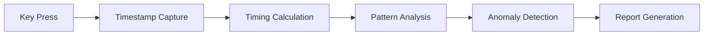

---

# 🔐 Advanced Keystroke Dynamics Analysis Tool

<div align="center">


**Professional behavioral biometrics tool for analyzing typing patterns.**

[Features](#-features) • [Installation](#-installation) • [Usage](#-usage) • [Documentation](#-documentation) • [Examples](#-examples) • [Contributing](#-contributing)


</div>

---

## 📋 Table of Contents

* [Overview](#-overview)
* [Features](#-features)
* [Installation](#-installation)
* [Quick Start](#-quick-start)
* [Usage Guide](#-usage-guide)
* [Configuration](#-configuration)
* [Reports](#-report-analysis)
* [Privacy & Security](#-privacy--security)
* [Use Cases](#-use-cases)
* [Technical Details](#-technical-details)
* [Contributing](#-contributing)
* [License](#-license)
* [Disclaimer](#-disclaimer)

---

## 🎯 Overview

A Python-based tool capturing typing patterns with millisecond precision. Ideal for security research, behavioral authentication, and personal typing insights.

**Highlights:**

* 🎨 Interactive HTML reports
* ⚡ Real-time monitoring
* 📝 Full word tracking
* 🔬 Statistical anomaly detection
* 🛡️ Privacy-first options
* 🌍 Cross-platform support

---

## ✨ Features

| Feature                 | Description                                      |
| ----------------------- | ------------------------------------------------ |
| ⌨️ Keystroke Monitoring | Capture every keypress with timing               |
| 📝 Word Tracking        | Record complete words and phrases                |
| 📊 Stats & Metrics      | Dwell, flight times, KPM/WPM, digraphs/trigraphs |
| 🎯 Anomaly Detection    | Detect unusual typing patterns                   |
| 🎨 Reports              | Interactive HTML & JSON export                   |
| 🔔 Notifications        | Optional Telegram/Discord alerts                 |
| 🔒 Privacy Controls     | Anonymization and hashing options                |

---

## 🔬 How It Works



Pipeline: Capture → Process → Pattern → Analyze → Detect → Report.

---

## 🚀 Installation

```bash
git clone https://github.com/notfawadmir/Keylogger.git
cd Keylogger
pip install pynput requests
python keylogger.py
```

---

## 🎮 Quick Start

1. Launch tool: `python keylogger.py`
2. Confirm authorization: `yes`
3. Select **Start Monitoring**
4. Type and press `ESC` to stop
5. View generated HTML report

---

## 📖 Usage Guide

**Menu Options:**

1. Start Monitoring (Default 1h)
2. Custom Duration
3. Configure Settings
4. View Configuration
5. Test Notifications
6. Exit

**Configuration** includes privacy, output, analysis, and notifications.

---

## ⚙️ Configuration

* **Privacy:** Capture content, anonymize, hash keys, track words
* **Analysis:** Session duration, anomaly threshold, min samples
* **Notifications:** Telegram/Discord setup

---

## 📊 Report Analysis

**Dashboard Metrics:** Keystrokes, words, KPM/WPM, response time, anomalies
**Timing Stats:** Dwell, flight times, digraphs/trigraphs
**Anomaly Detection:** Z-score flagged keystrokes

---

## 🛡️ Privacy & Security

* Local processing only, no cloud storage
* Configurable anonymization
* Session isolation & secure deletion
* **Ethical use only**

---

## 🎯 Use Cases

* Personal typing analysis
* Security research & authentication
* Ergonomics & productivity studies
* Educational purposes

---

## 🔧 Technical Details

**Architecture:** Config, KeystrokeEvent, WordTracker, TimingMetrics, AnomalyDetector, Monitor, CLI
**Algorithms:** Z-score detection, dwell & flight time, word tracking
**Performance:** <1ms latency, <1% CPU, ~10-50MB RAM
**Dependencies:** Python 3.7+, pynput, requests

---

## 📚 Examples

* Quick typing test
* Baseline comparison
* Password entry pattern study
* Coding vs. writing sessions

---

## 🤝 Contributing

Fork → Branch → Commit → PR → Star ⭐
Follow PEP8, add docstrings, type hints, tests.

---

## 📜 License

MIT License © 2024 notfawadmir

---

## ⚠️ Disclaimer

Use **only** for personal, authorized research or education. Unauthorized monitoring is illegal. Users are responsible for compliance.

---

## 📞 Contact

* GitHub: [notfawadmir](https://github.com/notfawadmir)
* Issues & Discussions on GitHub

---

## 🗺️ Roadmap

* ML-based anomaly detection
* Multi-session reports
* Real-time dashboard
* CSV export & heatmaps
* Mobile & cloud integration

---

<div align="center">

⭐ If this tool helps you, please star the repo!
Made with ❤️ by [@notfawadmir](https://github.com/notfawadmir)

</div>

---

**Last Updated**: Nov 2024 | **Version**: 2.0 | **Status**: Active

---
